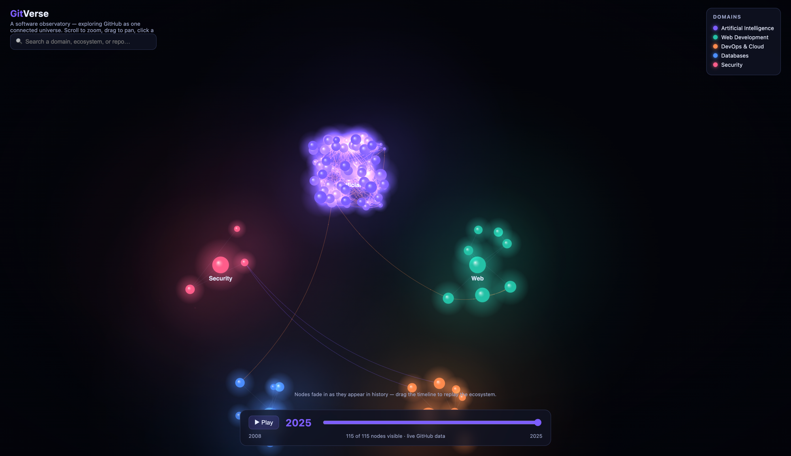
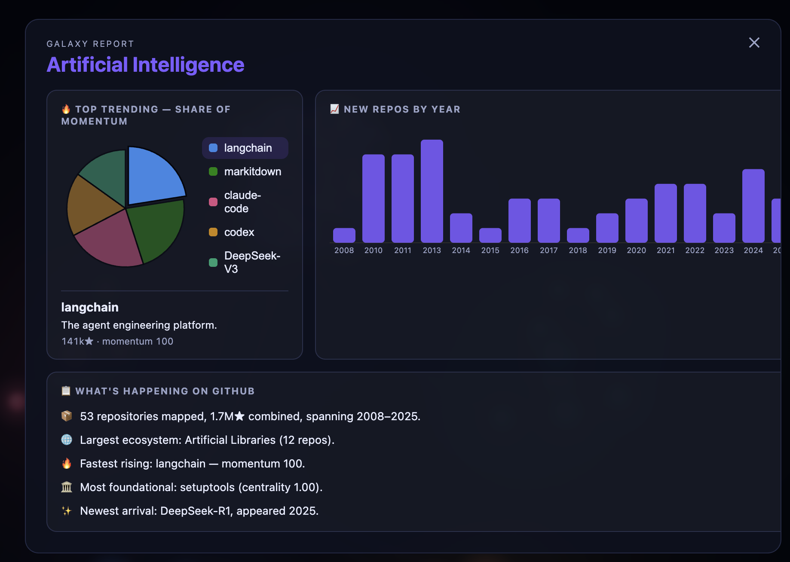

# GitVerse

**A software observatory — explore GitHub as one connected universe.**

GitVerse maps open-source repositories into a living galaxy: projects cluster into
domains (AI, Web, DevOps, Databases, Security), sized by popularity and linked by
their real dependencies. A timeline lets you replay how the ecosystem grew from
2008 to today.



## What it is

Each **star** is a repository. Stars pull into five **galaxies** (domains), and
within them into **ecosystems** (e.g. *Large Language Models*, *Frontend
Frameworks*). Edges are real relationships pulled from GitHub — dependencies,
shared technology, and semantic similarity.

- 🌌 **Galaxy map** — a WebGL/canvas force-graph with nebula haze, twinkling
  starfield, and glowing nodes. Scroll to zoom, drag to pan, click any node.
- 🕐 **Timeline** — scrub or ▶ play from 2008 → 2025; nodes fade in at their real
  birth year so you watch ecosystems form.
- 🔭 **Node detail** — click a repo for stars, forks, contributors, language,
  license, centrality (PageRank), momentum, and its relationships.
- 🎨 **Semantic zoom** — galaxy labels always show; ecosystems and repos reveal
  their names as you zoom in.

## Search → Galaxy Report

Search any domain, ecosystem, or repo (try **"AI"**) to open a **Galaxy Report** —
a one-domain snapshot of what's happening on GitHub:



1. **🔥 Top trending** — a pie of the five most-trending repos by momentum; click a
   slice to see its one-liner and stats.
2. **📈 New repos by year** — a bar chart of how the domain grew over time.
3. **📋 What's happening** — an auto-generated summary: repos mapped, combined
   stars, largest ecosystem, fastest rising, most foundational, and newest arrival.

## How it works

A small ingestion pipeline (`ingest/`) builds the graph from the **GitHub REST
API**:

1. Starts from a curated **seed set** of well-known repos across the five domains
   (`ingest/seeds.ts`).
2. **BFS-expands** outward by reading each repo's dependency graph (SBOM) and
   resolving packages → source repos via npm / PyPI / crates.io / Go.
3. Computes **PageRank** (foundational-ness) and **momentum** (stars/day).
4. **Classifies** discovered repos with a three-tier hybrid: graph
   label-propagation → keyword heuristic cross-check → **Claude** for the
   genuinely ambiguous cases.

The result is written to `public/graph.json`; the React app (`src/`) renders it.
If no snapshot exists, it falls back to curated sample data.

## Getting started

```bash
npm install
npm run dev          # → http://localhost:5173
```

### Refresh the data from GitHub

```bash
npm run ingest                                   # seeds only (unauthenticated)
GITHUB_TOKEN=… npm run ingest                    # BFS-expand (~60+ repos)
GITHUB_TOKEN=… ANTHROPIC_API_KEY=… npm run ingest # + Claude classification
```

A GitHub token (no scopes needed) raises rate limits and unlocks SBOM,
contributor, and activity data. Tune breadth with `GV_DEPTH` and `GV_BUDGET`.

## Tech

React · TypeScript · Vite · `react-force-graph-2d` · d3-force · Anthropic SDK.
Charts are hand-built inline SVG — no charting dependency.

> **Full vision:** [`ARCHITECTURE.md`](ARCHITECTURE.md) describes the complete
> production platform (historical replay via GH Archive, graph database,
> code-level tiers, grounded AI). This repo is the working core of that idea.
