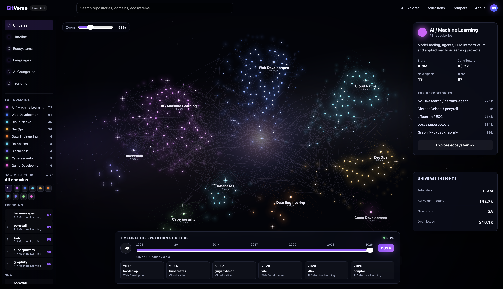
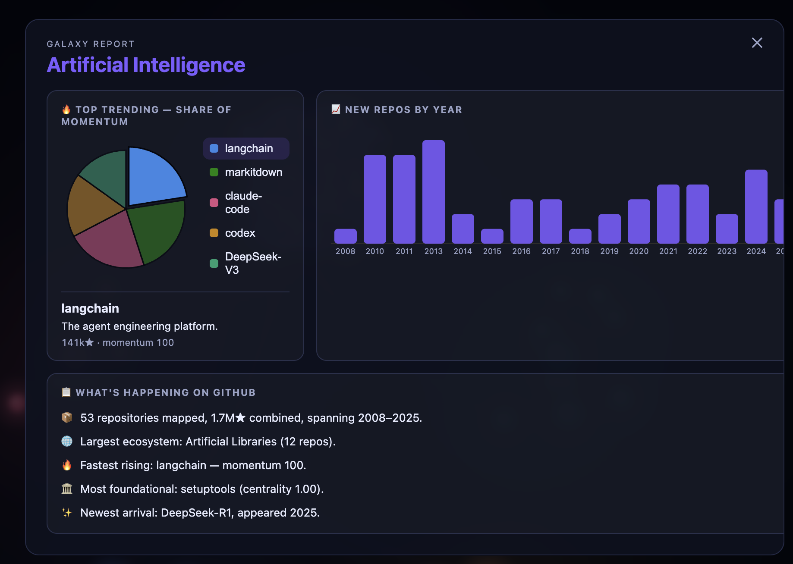

# GitVerse

**A software observatory — explore GitHub as one connected universe.**

GitVerse maps open-source repositories into a living galaxy: projects cluster into
domains (AI, Web, Cloud Native, DevOps, Data Engineering, Databases, Blockchain,
Cybersecurity, Game Development), sized by popularity and linked by their real
dependencies. A timeline lets you replay how the ecosystem grew from 2008 to
today.



## What it is

Each **star** is a repository. Stars pull into topic **galaxies** (domains), and
within them into **ecosystems** (e.g. *Large Language Models*, *Frontend
Frameworks*). Edges are real relationships pulled from GitHub — dependencies,
shared technology, and semantic similarity.

- 🌌 **Galaxy map** — a WebGL/canvas force-graph with nebula haze, twinkling
  starfield, and glowing nodes. Scroll to zoom, drag to pan, click any node.
- 🕐 **Timeline** — scrub or ▶ play from 2008 → 2025; nodes fade in at their real
  birth year so you watch ecosystems form.
- 🔭 **Node detail** — click a repo for stars, forks, contributors, language,
  license, centrality (PageRank), momentum, and its relationships.
- 🎨 **Semantic zoom** — galaxy labels always show; ecosystems and repos reveal
  their names as you zoom in.

## Search → Galaxy Report

Search any domain, ecosystem, or repo (try **"AI"**) to open a **Galaxy Report** —
a one-domain snapshot of what's happening on GitHub:



1. **🔥 Top trending** — a pie of the five most-trending repos by momentum; click a
   slice to see its one-liner and stats.
2. **📈 New repos by year** — a bar chart of how the domain grew over time.
3. **📋 What's happening** — an auto-generated summary: repos mapped, combined
   stars, largest ecosystem, fastest rising, most foundational, and newest arrival.

## How it works

A small ingestion pipeline (`ingest/`) builds the graph from the **GitHub REST
API**:

1. Runs **GitHub Search discovery** for recent, active, and high-star repos in
   each domain/topic.
2. Adds a curated **seed set** of well-known repos (`ingest/seeds.ts`) so the
   graph still has stable anchors.
3. Optionally **BFS-expands** outward by reading each repo's dependency graph
   (SBOM) and resolving packages → source repos via npm / PyPI / crates.io / Go.
4. Computes PageRank plus explicit **new**, **trending**, and **contribution**
   scores.
5. **Classifies** fetched repos with a model when configured: **Claude** via
   `ANTHROPIC_API_KEY`, or an OpenAI-compatible local/hosted model via
   `GV_LOCAL_URL`. Without a model, it falls back to graph label-propagation +
   keyword heuristics.

The result is written to `public/graph.json`; the React app (`src/`) renders it.
Every ingest also writes a daily metric snapshot under `public/history/`. If no
graph snapshot exists, the app falls back to curated sample data.

## Getting started

```bash
npm install
npm run dev          # → http://localhost:5173
```

### Refresh the data from GitHub

```bash
npm run ingest                                   # seeds only (unauthenticated)
GITHUB_TOKEN=… npm run ingest                     # Search + BFS enrichment
GITHUB_TOKEN=… ANTHROPIC_API_KEY=… GV_CLASSIFIER=claude npm run ingest
```

A GitHub token (no scopes needed) raises rate limits and unlocks SBOM,
contributor, and activity data. Tune breadth with `GV_DEPTH` and `GV_BUDGET`.
Set `GV_SEARCH=0` to disable GitHub Search and return to seed/dependency-only
ingestion.

### Classify with Qwen instead of Claude

The ingest can classify against a Qwen model rather than Claude — anything that
speaks the OpenAI-compatible `/chat/completions` API works. Set
`GV_CLASSIFIER=local` with `GV_LOCAL_URL` to use it.

**Hosted (recommended — no install, no weights).** Use Hugging Face's inference
router; you only need a free [HF token](https://huggingface.co/settings/tokens):

```bash
GITHUB_TOKEN=… \
GV_CLASSIFIER=local \
GV_LOCAL_URL=https://router.huggingface.co/v1 \
GV_LOCAL_MODEL=Qwen/Qwen2.5-3B-Instruct \
GV_LOCAL_KEY=hf_xxx \
npm run ingest
```

(Or just fill `GV_LOCAL_KEY` in `.env`, where these are pre-configured.)

**Fully offline (optional).** Run the weights yourself: `ingest/serve_qwen.py`
loads a local Qwen once and exposes the same endpoint. Requires
`pip install -r ingest/requirements.txt` (torch + transformers):

```bash
python3 ingest/serve_qwen.py                        # serves :8080, model stays warm
GITHUB_TOKEN=… GV_CLASSIFIER=local GV_LOCAL_URL=http://localhost:8080/v1 npm run ingest
```

## Tech

React · TypeScript · Vite · `react-force-graph-2d` · d3-force · Anthropic SDK.
Charts are hand-built inline SVG — no charting dependency.

> **Full vision:** [`ARCHITECTURE.md`](ARCHITECTURE.md) describes the complete
> production platform (historical replay via GH Archive, graph database,
> code-level tiers, grounded AI). This repo is the working core of that idea.
